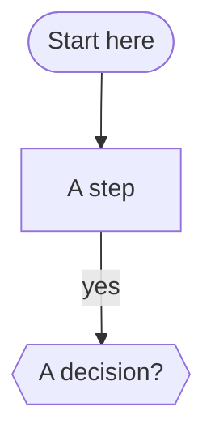
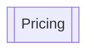
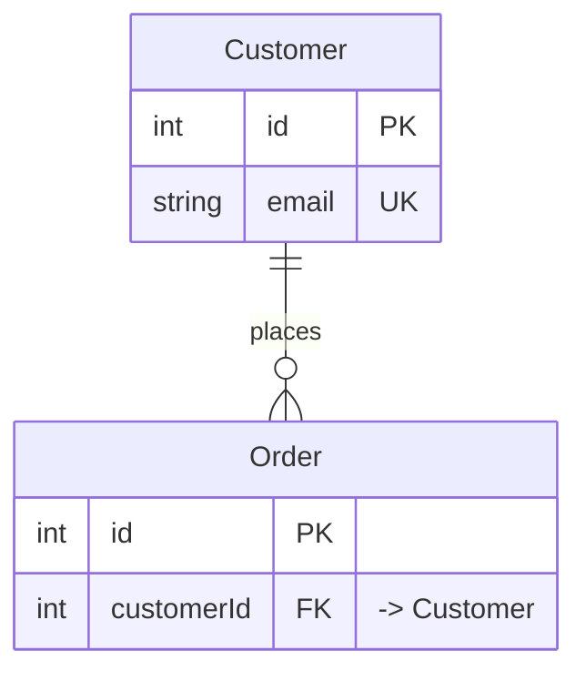
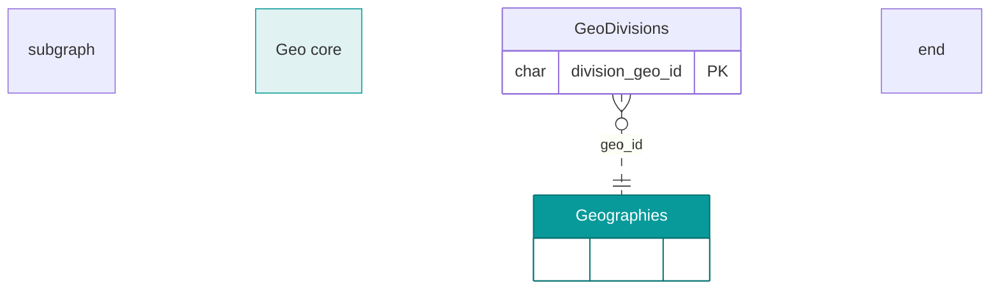
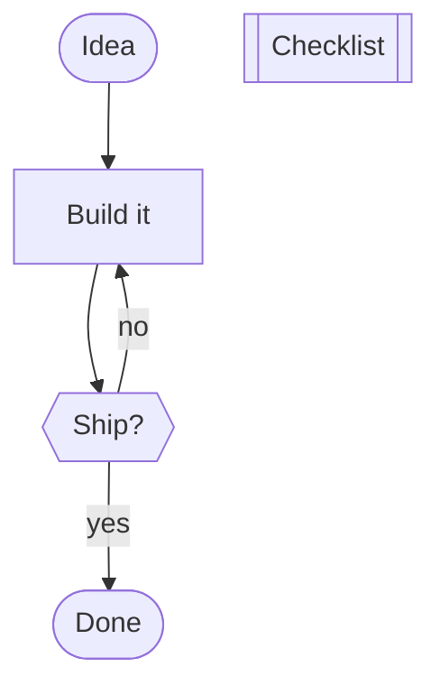

# Driving MerScribe from an AI agent

MerScribe's diagram **is a single Markdown file** (by default `~/Downloads/diagram.md`, or whatever file is linked via the save-status pill in the toolbar). To draw or change a diagram, just **read and write that `.md` file** — the open app reflects your edits on the canvas within about a second, and any edits made on the canvas are written back to the same file. It's lossless two-way sync.

> Paste this whole file into your agent's context/instructions. The one rule that matters: **express structure, not layout.** Never worry about x/y positions — MerScribe auto-arranges every time the structure changes.

---

## The document format

A MerScribe `.md` is ordinary Markdown made of these parts (only the flowchart block is required):

1. A Mermaid **`flowchart`** block — the boxes and arrows.
2. An optional Mermaid **`erDiagram`** block — entities and relationships.
3. **`### Title`** sections containing a GitHub-flavored **table** — the contents of a table object.
4. **`### Title`** sections containing prose — the body of a **note** object.
5. **`### <Host Title> — notes`** sections — a note **attached** to another object.

A file may hold **both** a flowchart block and an erDiagram block (plus tables/notes).
MerScribe renders them together and shows a **block switcher** (All · Flow · ER) in the
toolbar so each diagram can be viewed on its own. The blocks don't share nodes — keep each
focused (e.g. a colored flowchart overview + a detailed erDiagram of the same schema).

---

## Flowcharts (boxes & arrows)

````markdown

````

- **Direction:** `flowchart TD` (top-down), or `LR`, `BT`, `RL`.
- **Node shapes:** `["x"]` rectangle · `("x")` rounded · `(["x"])` stadium · `{{"x"}}` hexagon (use this for decisions — avoid `{}` diamonds, they render poorly) · `[("x")]` cylinder · `(("x"))` circle.
- **Edges:** `-->` arrow · `---` plain line · `-.->` dashed · `==>` thick. Put a label with `a -->|"label"| b`. End markers can differ per side, e.g. `a o--o b`, `a x--x b`, `a <--> b`.
- **Groups (containers):** wrap nodes in a subgraph:
  ````markdown
  subgraph g1 ["Group title"]
    a["inside"]
    b["also inside"]
  end
  ````

---

## Tables

A table is a flowchart node declared with `[["Title"]]`, **plus** a matching `### Title` section that holds a GFM table:

````markdown


### Pricing

| Plan | Price | Seats |
| --- | --- | --- |
| Free | $0 | 1 |
| Team | $20 | 10 |
````

The `### Pricing` heading must match the node's title exactly.

---

## Notes

- **Free note** (floats on its own): a node `n1>"Title"]` **plus** a `### Title` section with the note's body (markdown allowed):

  ````markdown
  ```mermaid
  flowchart TD
    n1>"Reminder"]
  ```

  ### Reminder

  Ship on **Friday**. Don't forget the changelog.
  ````

- **Attached note** (sticks to another object as a footnote): just add a section titled `### <that object's title> — notes`. No node needed — it attaches by title:

  ````markdown
  ### Pricing — notes

  Prices are monthly, billed annually.
  ````

  (The separator is an em dash: ` — notes`. Easiest is to add a note in the app once and copy the format.)

---

## ER diagrams

````markdown

````

Crow's-foot cardinality: `||` one, `o{` zero-or-many, `|{` one-or-many, `o|` zero-or-one.

**Field-level links.** MerScribe draws each relationship from the **foreign-key row** to the
**primary-key row** it references (not box-to-box). It picks the fields by, in order:
(1) a field named in the relationship label — `: "customerId"`; (2) an `FK` field whose
comment points at the other entity — `customerId FK "-> Customer"` (also recognizes
`"... link to customers"`); (3) a name match — `customerId` → `Customer`. **So annotate
your FKs:** give them the `FK` key and a `"-> Target"` comment (or name them after the
target). The crow's foot then lands on the exact FK/PK rows.

**Grouping & color.** ER entities take the same `subgraph … end` grouping and
`style` / `classDef`+`class` coloring as flowcharts — and MerScribe round-trips them:

````markdown

````

**Tables vs entities.** A Mermaid `erDiagram` cannot contain a GFM table — the entities ARE
the tabular objects (their rows are fields). If you need a free-standing data table, use a
flowchart `[["Title"]]` node (see Tables); it can live in the same file as the erDiagram.

---

## Colors

Color a node with a Mermaid `style` line in the flowchart block — `fill` (background), `stroke` (border), `color` (text):

```
style ok fill:#dcfce7,stroke:#22c55e,color:#166534
```

Edge color: `linkStyle <index> stroke:#3b82f6` (index = the edge's order in the block, from 0). Colors round-trip losslessly.

## Working effectively

- **Edit the linked file** (default `~/Downloads/diagram.md`). Changes appear on the canvas within ~1s while the app is open.
- **Add, rename, remove, and reconnect freely.** Structural changes trigger a clean automatic re-layout (the user can also click **Auto-arrange**).
- **IDs are stable, labels are free.** Renaming a node's label (`a["New label"]`) keeps its id `a`, so existing edges to `a` keep working. Pick short ids; the label is what's shown.
- **Don't add positions or styling for layout.** MerScribe owns layout.
- **Round-trip is lossless.** What you write is what the canvas shows; what the user draws comes back as this same Markdown — so you can read the file to see the current state, edit it, and read it again.

### Minimal end-to-end example

````markdown


### Checklist

| Item | Done |
| --- | --- |
| Tests pass | yes |
| Docs updated | no |

### Checklist — notes

Block release until docs are updated.
````
