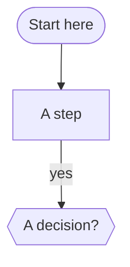
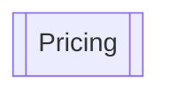
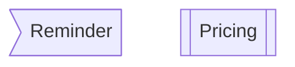
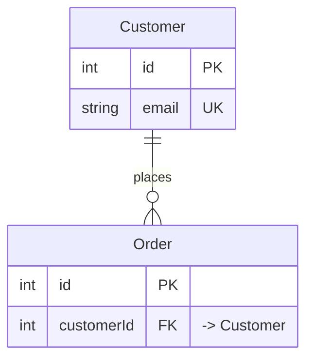
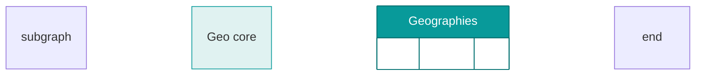
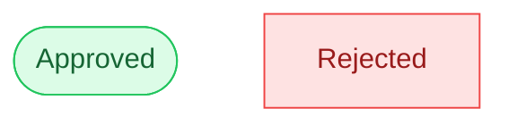

# MerScribe — guide for your AI agent

This file sits next to your MerScribe diagram (`diagram.md`). **Hand it to your AI agent** (paste its contents into the agent's instructions). It explains how to read and write the diagram so the agent can build and edit it for you.

The diagram **is** the `diagram.md` file in this folder. Edit that file and MerScribe updates the canvas live (within ~1s while the app is open); edits made on the canvas are written back to the same file. It's lossless two-way sync.

> The one rule that matters: **express structure, not layout.** Never set x/y positions — MerScribe auto-arranges whenever the structure changes.

---

## The document format

`diagram.md` is ordinary Markdown made of these parts (only the flowchart block is required):

1. A Mermaid **`flowchart`** block — the boxes and arrows.
2. An optional Mermaid **`erDiagram`** block — entities and relationships.
3. **`### Title`** sections containing a GitHub-flavored **table** — the contents of a table object.
4. **`### Title`** sections containing prose — the body of a **note** object.
5. **`### <Host Title> — notes`** sections — a note **attached** to another object.

A file may hold **both** a flowchart block and an erDiagram block (plus tables/notes).
MerScribe renders them together and shows a **block switcher** (All · Flow · ER) in the
toolbar so each diagram can be viewed on its own. The blocks don't share nodes — keep each
focused (e.g. a colored flowchart overview + a detailed erDiagram of the same schema).

---

## Flowcharts (boxes & arrows)

````markdown

````

- **Direction:** `flowchart TD` (top-down), or `LR`, `BT`, `RL`.
- **Node shapes:** `["x"]` rectangle · `("x")` rounded · `(["x"])` stadium · `{{"x"}}` hexagon (use for decisions — avoid `{}` diamonds, they render poorly) · `[("x")]` cylinder · `(("x"))` circle.
- **Edges:** `-->` arrow · `---` plain line · `-.->` dashed · `==>` thick. Label with `a -->|"label"| b`. End markers can differ per side: `a o--o b`, `a x--x b`, `a <--> b`.
- **Groups (containers):**
  ````markdown
  subgraph g1 ["Group title"]
    a["inside"]
    b["also inside"]
  end
  ````

---

## Tables

A table is a flowchart node `[["Title"]]` **plus** a matching `### Title` section with a GFM table:

````markdown


### Pricing

| Plan | Price |
| --- | --- |
| Free | $0 |
| Team | $20 |
````

The `### Pricing` heading must match the node's title exactly.

---

## Notes

- **Free note** (floats): a node `n1>"Title"]` **plus** a `### Title` section with the body (markdown allowed).
- **Attached note** (sticks to an object): a `### <that object's title> — notes` section — no node needed; it attaches by title. The separator is an em dash (` — notes`).

````markdown


### Reminder

Ship on **Friday**.

### Pricing — notes

Billed annually.
````

---

## ER diagrams

````markdown

````

Crow's-foot cardinality: `||` one · `o{` zero-or-many · `|{` one-or-many · `o|` zero-or-one.

**Field-level links.** MerScribe draws each relationship from the **FK row** to the **PK row**
it references. It picks the fields by, in order: (1) a field named in the label —
`: "customerId"`; (2) an `FK` field whose comment points at the other entity —
`customerId FK "-> Customer"` (also `"... link to customers"`); (3) name match
(`customerId` → `Customer`). **Annotate FKs** (the `FK` key + a `"-> Target"` comment, or
name them after the target) so the crow's foot lands on the right rows.

**Grouping & color.** ER entities take the same `subgraph … end` grouping and `style` /
`classDef`+`class` coloring as flowcharts, and MerScribe round-trips them:

````markdown

````

**Tables vs entities.** An `erDiagram` can't hold a GFM table — entities ARE the tabular
objects. For a free-standing data table use a flowchart `[["Title"]]` node in the same file.

---

## Colors

Color a node by adding a Mermaid `style` line in the flowchart block — `fill` (background), `stroke` (border), `color` (text):

````markdown

````

Edge color: `linkStyle <index> stroke:#3b82f6` (index = the edge's order in the block, starting at 0). These round-trip losslessly.

---

## Working effectively

- **Edit `diagram.md` in this folder.** Changes appear on the canvas within ~1s while the app is open.
- **Add, rename, remove, and reconnect freely** — structural changes re-arrange automatically (the user can also click **Auto-arrange** / **Auto Layout**).
- **IDs are stable; labels are free.** `a["New label"]` keeps the id `a`, so edges to `a` keep working. Use short ids; the label is what's shown.
- **Never add positions or styling for layout** — MerScribe owns layout.
- **Lossless round-trip:** read the file to see the current state, edit it, read it again.
