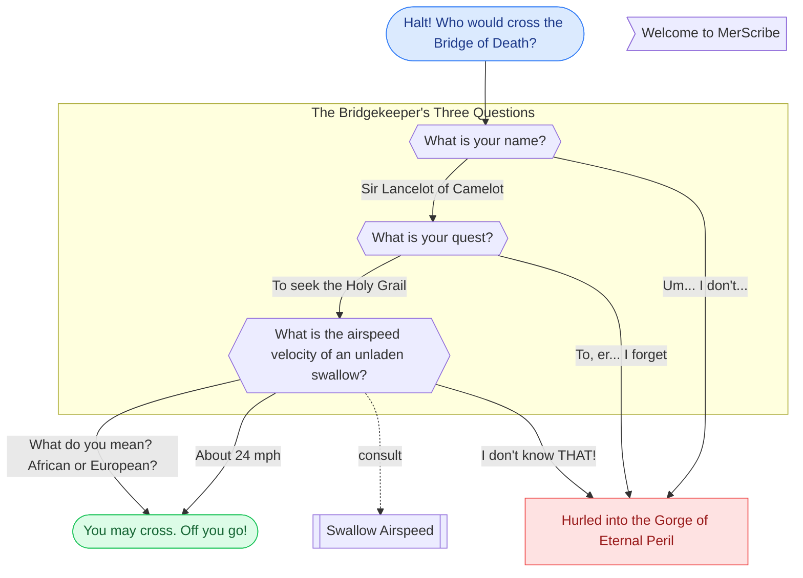

### Swallow Airspeed

| Swallow | Origin | Airspeed |
| --- | --- | --- |
| African | Non-migratory | ~24 mph |
| European | Migratory | Unknown |

### Swallow Airspeed — notes

The Bridgekeeper never says *which* swallow — so answer his question with a question, and it's **he** who gets flung into the gorge.

### Welcome to MerScribe

Welcome, brave knight! 🏰

This whole board is **one Markdown file** — edit it on the canvas or in the `.md`, and the two stay in sync.

- Press **N** or double-click to add a node
- Drag from a node's edge to connect two nodes
- Drop a note onto a node to attach it (like the one on the table)
- **Auto-arrange** in the toolbar tidies everything up

🤖 **Using an AI agent?** Point it at `merscribe-agent-guide.md` (saved next to this diagram) — it explains how to build and edit this board from the file.
