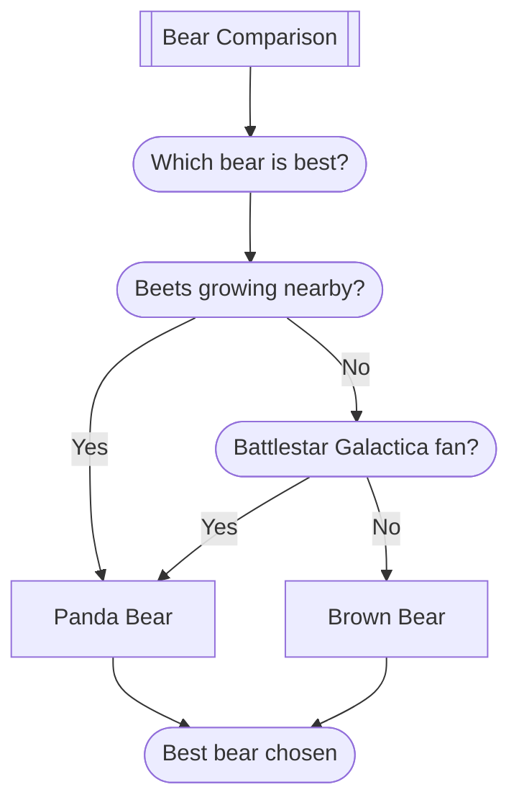

### Bear Comparison

| Bear | Strength | Specialty |
| --- | --- | --- |
| Black Bear | High | Identity theft |
| Brown Bear | Medium | Catching salmon |
| Panda | Low | Looking cute |

### Bear Comparison — notes

Remember
- Bears, beets, Battlestar Galactica.
- When in doubt, pick the **Black Bear**.